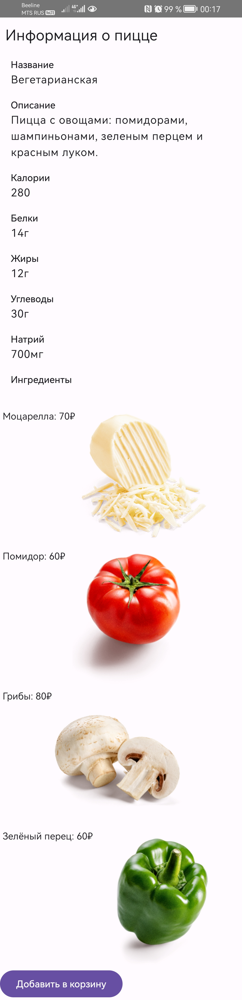
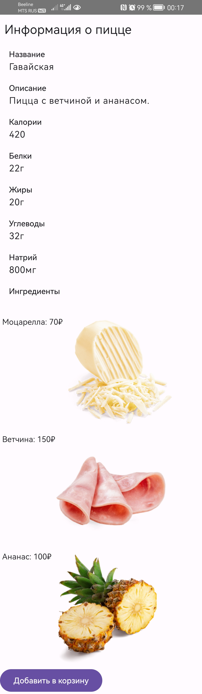

Пицца

Требования:

Приложение позволяет пользователям заказать пиццу. На странице каталога показаны доступные пиццы, при клике на любую из пицц, пользователь может увидеть информацию о конкретной пицце и добавить ее в корзину с топпингами.

1. Реализована страница/экран каталога со списком пицц, список пицц получен с помощью запроса **get** /pizzas/catalog
2. Реализовано модальное окно/экран конкретной пиццы

Написаны data классы для создания корзины и оформления заказа
Написан код для выбора топпингов и вида теста, в процессе реализации написание страницы корзины

